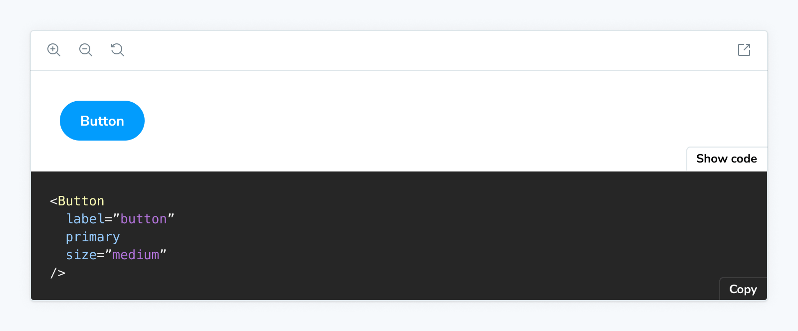

<YouTubeCallout id="uAA1JvLcl-w" title="Avoid Documentation Nightmares with Storybook's Canvas Doc Block" params='start=148' />

The `Canvas` block is a wrapper around a [`Story`](./doc-block-story.md), featuring a toolbar that allows you to interact with its content while automatically providing the required [`Source`](./doc-block-source.md) snippets.



When using the Canvas block in MDX, it references a story with the `of` prop:

<!-- prettier-ignore-start -->
```md
{/* ButtonDocs.mdx */}

import { Meta, Canvas } from '@storybook/blocks';
import * as ButtonStories from './Button.stories';

<Meta of={ButtonStories} />

<Canvas of={ButtonStories.Primary} />
```
<!-- prettier-ignore-end -->

<Callout variant="info" icon="💡">

In previous versions of Storybook it was possible to pass in arbitrary components as children to `Canvas`. That is deprecated and the `Canvas` block now only supports a single story.

</Callout>

## Canvas

```js
import { Canvas } from '@storybook/blocks';
```

<details>
<summary>Configuring with props <strong>and</strong> parameters</summary>

ℹ️ Like most blocks, the `Canvas` block is configured with props in MDX. Many of those props derive their default value from a corresponding [parameter](../writing-stories/parameters.md) in the block's namespace, `parameters.docs.canvas`.

The following `sourceState` configurations are equivalent:

<!-- prettier-ignore-start -->

<CodeSnippets
  paths={[
    'angular/api-doc-block-canvas-parameter.ts.mdx',
    'web-components/api-doc-block-canvas-parameter.js.mdx',
    'web-components/api-doc-block-canvas-parameter.ts.mdx',
    'common/api-doc-block-canvas-parameter.js.mdx',
    'common/api-doc-block-canvas-parameter.ts.mdx',
  ]}
/>

<!-- prettier-ignore-end -->

<!-- prettier-ignore-start -->
```md
{/* ButtonDocs.mdx */}

<Canvas of={ButtonStories.Basic} sourceState="shown" />
```
<!-- prettier-ignore-end -->

The example above applied the parameter at the [story](../writing-stories/parameters.md#story-parameters) level, but it could also be applied at the [component](../writing-stories/parameters.md#component-parameters) (or meta) level or [project](../writing-stories/parameters.md#global-parameters) level.

</details>

### `additionalActions`

Type:

<!-- prettier-ignore-start -->
```ts
Array<{
  title: string | JSX.Element;
  className?: string;
  onClick: () => void;
  disabled?: boolean;
}>;
```
<!-- prettier-ignore-end -->

Default: `parameters.docs.canvas.additionalActions`

Provides any additional custom actions to show in the bottom right corner. These are simple buttons that do anything you specify in the `onClick` function.

<!-- prettier-ignore-start -->
```md
{/* ButtonDocs.mdx */}

import { Meta, Story, Canvas, SourceState } from '@storybook/blocks';
import * as ButtonStories from './Button.stories';

<Meta of={ButtonStories} />

{/* with an additional action */}
<Canvas
  additionalActions={[
    {
      title: 'Open in GitHub',
      onClick: () => {
        window.open(
          'https://github.com/storybookjs/storybook/blob/next/code/ui/blocks/src/examples/Button.stories.tsx',
          '_blank'
        );
      },
    }
  ]}
  of={ButtonStories.Primary}
/>
```
<!-- prettier-ignore-end -->

### `className`

Type: `string`

Default: `parameters.docs.canvas.className`

Provides HTML class(es) to the preview element, for custom styling.

### `layout`

Type: `'centered' | 'fullscreen' | 'padded'`

Default: `parameters.layout` or `parameters.docs.canvas.layout` or `'padded'`

Specifies how the canvas should layout the story.

- **centered**: Center the story within the canvas
- **padded**: (default) Add padding to the story
- **fullscreen**: Show the story as-is, without padding

In addition to the `parameters.docs.canvas.layout` property or the `layout` prop, the `Canvas` block will respect the `parameters.layout` value that defines [how a story is laid out](../configure/story-layout.md) in the regular story view.

### `meta`

Type: CSF file exports

Specifies the CSF file to which the story is associated.

You can render a story from a CSF file that you haven’t attached to the MDX file (via `Meta`) by using the `meta` prop. Pass the **full set of exports** from the CSF file (not the default export!).

<!-- prettier-ignore-start -->
```md
{/* ButtonDocs.mdx */}

import { Meta, Canvas } from '@storybook/blocks';
import * as ButtonStories from './Button.stories';
import * as HeaderStories from './Header.stories';

<Meta of={ButtonStories} />

{/* Although this MDX file is largely concerned with Button,
    it can render Header stories too */}
<Canvas of={HeaderStories.LoggedIn} meta={HeaderStories} />
```
<!-- prettier-ignore-end -->

### `of`

Type: Story export

Specifies which story's source is displayed.

### `source`

Type: `SourceProps['code'] | SourceProps['format'] | SourceProps['language'] | SourceProps['type']`

Specifies the props passed to the inner `Source` block. For more information, see the `Source` Doc Block [documentation](./doc-block-source.md).

<Callout variant="info" icon="💡">

The dark prop is ignored, as the `Source` block is always rendered in dark mode when shown as part of a `Canvas` block.

</Callout>

### `sourceState`

Type: `'hidden' | 'shown' | 'none'`

Default: `parameters.docs.canvas.sourceState` or `'hidden'`

Specifies the initial state of the source panel.

- **hidden**: the source panel is hidden by default
- **shown**: the source panel is shown by default
- **none**: the source panel is not available and the button to show it is not rendered

### `story`

Type: `StoryProps['inline'] | StoryProps['height'] | StoryProps['autoplay']`

Specifies the props passed to the inner `Story` block. For more information, see the `Story` Doc Block [documentation](./doc-block-story.md).

### `withToolbar`

Type: `boolean`

Default: `parameters.docs.canvas.withToolbar`

Determines whether to render a toolbar containing tools to interact with the story.

### `children`

(⛔️ **Deprecated**)

Type: `React.ReactNode`

Expects only [Story](./doc-block-story.md) children. Reference the story with the `of` prop instead.

### `columns`

(⛔️ **Deprecated**)

Type: `number`

Splits the stories based on the number of defined columns. Multiple stories are not supported.

### `isColumn`

(⛔️ **Deprecated**)

Type: `boolean`

Displays the stories one above the other. Multiple stories are not supported.

### `mdxSource`

(⛔️ **Deprecated**)

Type: `string`

Provides source to display. Use [`source.code`](#source) instead.

### `withSource`

(⛔️ **Deprecated**)

Type: `'open' | 'closed' | 'none'`

Controls the source code block visibility. Use [`sourceState`](#sourcestate) instead.

### `withToolbar`

(⛔️ **Deprecated**)

Type: `boolean`

Sets the Canvas toolbar visibility. Use [`story.withToolbar`](#story) instead.
