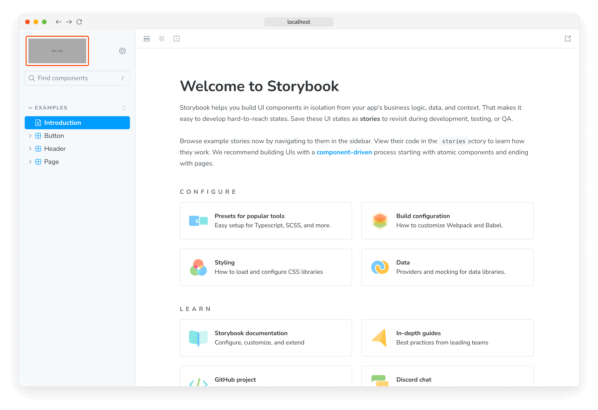
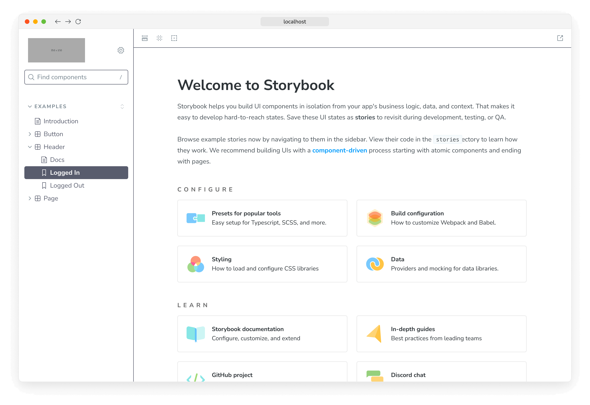

Storybook is theme-able using a lightweight theming API.

## Global theming

It's possible to theme Storybook globally.

Storybook includes two themes that look good out of the box: "light" and "dark". Unless you've set your preferred color scheme as dark, Storybook will use the light theme as default.

Make sure you have installed [`@storybook/addons`](https://www.npmjs.com/package/@storybook/addons) and [`@storybook/theming`](https://www.npmjs.com/package/@storybook/theming) packages.

```sh
yarn add --dev @storybook/addons @storybook/theming
```

As an example, you can tell Storybook to use the "dark" theme by modifying [`.storybook/manager.js`](./overview.md#configure-story-rendering):

<!-- prettier-ignore-start -->

<CodeSnippets
  paths={[
    'common/storybook-manager-dark-theme.js.mdx',
  ]}
/>

<!-- prettier-ignore-end -->

When setting a theme, set a complete theme object. The theme is replaced, not combined.

## Theming docs

[Storybook Docs](../writing-docs/introduction) uses the same theme system as Storybook’s UI but is themed independently from the main UI.

Supposing you have a Storybook theme defined for the main UI in [`.storybook/manager.js`](./overview.md#configure-story-rendering):

<!-- prettier-ignore-start -->

<CodeSnippets
  paths={[
    'common/storybook-manager-dark-theme.js.mdx',
  ]}
/>

<!-- prettier-ignore-end -->

Here's how you'd specify the same theme for docs in [`.storybook/preview.js`](./overview.md#configure-story-rendering):

<!-- prettier-ignore-start -->

<CodeSnippets
  paths={[
    'common/storybook-preview-docs-dark-theme.js.mdx',
  ]}
/>

<!-- prettier-ignore-end -->

Continue to read if you want to learn how to create your theme.

## Create a theme quickstart

The easiest way to customize Storybook is to generate a new theme using the `create()` function from `storybook/theming`. This function includes shorthands for the most common theme variables. Here's how to use it:

Inside your `.storybook` directory, create a new file called `YourTheme.js` and add the following:

<!-- prettier-ignore-start -->

<CodeSnippets
  paths={[
    'common/storybook-theme-example-variables.ts.mdx',
  ]}
/>

<!-- prettier-ignore-end -->

<div class="aside">
💡 If you're using <code>brandImage</code> to add your custom logo, you can use any of the most common image formats.
</div>

Above, we're creating a new theme that will:

- Use Storybook's `light` theme as a baseline.
- Replace Storybook's logo in the sidebar with our own (defined in the brandImage variable).
- Add custom branding information.
- Set the brand link to open in the same window (as opposed to a new one), via the `target` attribute.

Finally, we'll need to import the theme into Storybook. Create a new file called `manager.js` in your `.storybook` directory and add the following:

<!-- prettier-ignore-start -->

<CodeSnippets
  paths={[
    'common/storybook-manager-custom-theme.js.mdx',
  ]}
/>

<!-- prettier-ignore-end -->

Now your custom theme will replace Storybook's default theme, and you'll see a similar set of changes in the UI.



Let's take a look at a more complex example. Copy the code below and paste it in `.storybook/YourTheme.js`.

<!-- prettier-ignore-start -->

<CodeSnippets
  paths={[
    'common/your-theme.js.mdx',
  ]}
/>

<!-- prettier-ignore-end -->

Above, we're updating the theme with the following changes:

- A custom color palette (defined in the `app` and `color` variables).
- Custom fonts (defined in the `font` and `text` variables).

With the new changes introduced, the custom theme should yield a similar result.



<div class="aside">
💡 Many theme variables are optional, the <code>base</code> property is <strong>NOT</strong>.
</div>

The `@storybook/theming` package is built using TypeScript, which should help create a valid theme for TypeScript users. The types are part of the package itself.

## CSS escape hatches

The Storybook theme API is narrow by design. If you want to have fine-grained control over the CSS, all UI and Docs components are tagged with class names to make this possible. **Use at your own risk** as this is an advanced feature.

To style these elements, insert style tags into:

- For Storybook’s UI, use `.storybook/manager-head.html`
- For Storybook Docs, use `.storybook/preview-head.html`

<div class="aside">

💡 <strong>Caution:</strong> The same way as you can adjust your [preview’s head tag](../configure/story-rendering.md#adding-to-head), Storybook allows you to modify the code on the manager's side, through <code>.storybook/manager-head.html</code>. It can be helpful when adding theme styles that target Storybook's HTML, but it comes with a cost as Storybook's inner HTML can change at any time through the release cycle.

</div>

## MDX component overrides

If you're using MDX for docs, there's one more level of "themability". MDX allows you to completely override the rendered components from Markdown using a `components` parameter. It's an advanced usage that we don't officially support in Storybook, but it's a powerful construct if you need it.

Here's how you might insert a custom code renderer for `code` blocks on the page, in [`.storybook/preview.js`](./overview.md#configure-story-rendering):

<!-- prettier-ignore-start -->

<CodeSnippets
  paths={[
    'common/storybook-preview-custom-code-renderer.js.mdx',
  ]}
/>

<!-- prettier-ignore-end -->

You can even override a Storybook block component.

Here's how you might insert a custom `<Canvas />` block:

<!-- prettier-ignore-start -->

<CodeSnippets
  paths={[
    'common/storybook-preview-custom-canvas.js.mdx',
  ]}
/>

<!-- prettier-ignore-end -->

## Addons and theme creation

Some addons require specific theme variables that a Storybook user must add. If you share your theme with the community, make sure to support the official API and other popular addons, so your users have a consistent experience.

For example, the popular Actions addon uses [react-inspector](https://github.com/xyc/react-inspector/blob/master/src/styles/themes/chromeLight.js), which has themes of its own. Supply additional theme variables to style it like so:

<!-- prettier-ignore-start -->

<CodeSnippets
  paths={[
    'common/storybook-preview-extended-theme-variables.js.mdx',
  ]}
/>

<!-- prettier-ignore-end -->

## Using the theme for addon authors

Reuse the theme variables above for a native Storybook developer experience. The theming engine relies on [emotion](https://emotion.sh/), a CSS-in-JS library.

<!-- prettier-ignore-start -->

<CodeSnippets
  paths={[
    'common/storybook-theming-styled-import.js.mdx',
  ]}
/>

<!-- prettier-ignore-end -->

Use the theme variables in object notation:

<!-- prettier-ignore-start -->

<CodeSnippets
  paths={[
    'react/component-styled-variables-object-notation.js.mdx',
  ]}
/>

<!-- prettier-ignore-end -->

Or with template literals:

<!-- prettier-ignore-start -->

<CodeSnippets
  paths={[
    'react/component-styled-variables-template-literals.js.mdx',
  ]}
/>

<!-- prettier-ignore-end -->
