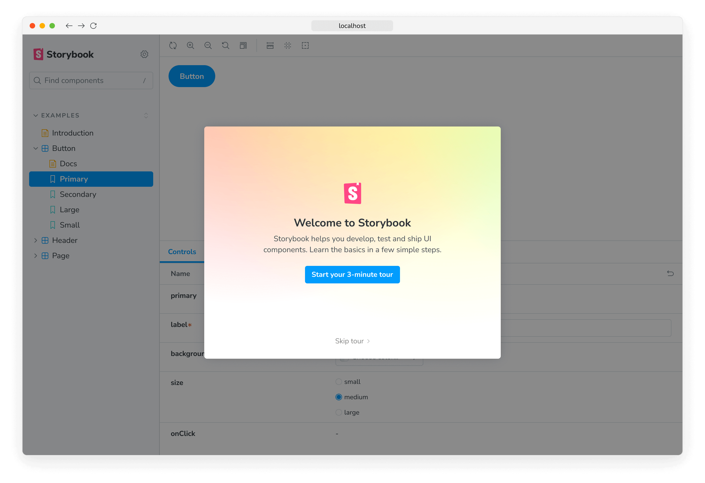

export const SUPPORTED_RENDERER = 'react';

Storybook for React & Webpack is a [framework](../contribute/framework.md) that makes it easy to develop and test UI components in isolation for [React](https://react.dev/) applications built with [Webpack](https://webpack.js.org/).

<If notRenderer={SUPPORTED_RENDERER}>

<Callout variant="info">

Storybook for React & Webpack is only supported in [React](?renderer=react) projects.

</Callout>

<!-- End non-supported renderers -->

</If>

<If renderer={SUPPORTED_RENDERER}>

## Requirements

- React ≥ 16.8
- Webpack ≥ 5.0
- Storybook ≥ 8.0

## Getting started

### In a project without Storybook

Follow the prompts after running this command in your React project's root directory:

<!-- prettier-ignore-start -->

<CodeSnippets
  paths={[
   'common/init-command.npx.js.mdx',
   'common/init-command.yarn.js.mdx',
   'common/init-command.pnpm.js.mdx',
  ]}
/>

<!-- prettier-ignore-end -->

[More on getting started with Storybook.](./install.md)

### In a project with Storybook

This framework is designed to work with Storybook 7+. If you’re not already using v7, upgrade with this command:

<!-- prettier-ignore-start -->

<CodeSnippets
  paths={[
    'common/storybook-upgrade.npm.js.mdx',
    'common/storybook-upgrade.pnpm.js.mdx',
    'common/storybook-upgrade.yarn.js.mdx'
  ]}
/>

<!-- prettier-ignore-end -->

#### Automatic migration

When running the `upgrade` command above, you should get a prompt asking you to migrate to `@storybook/react-webpack5`, which should handle everything for you. In case that auto-migration does not work for your project, refer to the manual migration below.

#### Manual migration

First, install the framework:

<!-- prettier-ignore-start -->

<CodeSnippets
  paths={[
    'react/react-webpack5-install.npm.js.mdx',
    'react/react-webpack5-install.pnpm.js.mdx',
    'react/react-webpack5-install.yarn.js.mdx'
  ]}
/>

<!-- prettier-ignore-end -->

Next, install and register your appropriate compiler addon, depending on whether you're using SWC (recommended) or Babel:

<Callout variant="info">

If your project is using [Create React App](#create-react-app-cra), you can skip this step.

</Callout>

<!-- prettier-ignore-start -->

<CodeSnippets
  paths={[
    'common/storybook-addon-compiler-swc-auto-install.npm.js.mdx',
    'common/storybook-addon-compiler-swc-auto-install.pnpm.js.mdx',
    'common/storybook-addon-compiler-swc-auto-install.yarn.js.mdx',
  ]}
/>

<!-- prettier-ignore-end -->

or

<!-- prettier-ignore-start -->

<CodeSnippets
  paths={[
    'common/storybook-addon-compiler-babel-auto-install.npm.js.mdx',
    'common/storybook-addon-compiler-babel-auto-install.pnpm.js.mdx',
    'common/storybook-addon-compiler-babel-auto-install.yarn.js.mdx',
  ]}
/>

<!-- prettier-ignore-end -->

More details can be found in the [Webpack builder docs](../builders/webpack.md#compiler-support).

Finally, update your `.storybook/main.js|ts` to change the framework property:

<!-- prettier-ignore-start -->

<CodeSnippets
  paths={[
    'react/react-webpack5-add-framework.js.mdx',
    'react/react-webpack5-add-framework.ts.mdx'
  ]}
/>

<!-- prettier-ignore-end -->

## Run the Setup Wizard

If all goes well, you should see a setup wizard that will help you get started with Storybook introducing you to the main concepts and features, including how the UI is organized, how to write your first story, and how to test your components' response to various inputs utilizing [controls](../essentials/controls).



If you skipped the wizard, you can always run it again by adding the `?path=/onboarding` query parameter to the URL of your Storybook instance, provided that the example stories are still available.

## Create React App (CRA)

Support for [Create React App](https://create-react-app.dev/) is handled by [`@storybook/preset-create-react-app`](https://github.com/storybookjs/presets/tree/master/packages/preset-create-react-app).

This preset enables support for all CRA features, including Sass/SCSS and TypeScript.

If you're working on an app that was initialized manually (i.e., without the use of CRA), ensure that your app has [react-dom](https://www.npmjs.com/package/react-dom) included as a dependency. Failing to do so can lead to unforeseen issues with Storybook and your project.

## API

### Options

You can pass an options object for additional configuration if needed:

```ts
// .storybook/main.ts
import type { StorybookConfig } from '@storybook/react-webpack5';

const config: StorybookConfig = {
  framework: {
    name: '@storybook/react-webpack5',
    options: {
      // ...
    },
  },
};

export default config;
```

#### `builder`

Type: `Record<string, any>`

Configure options for the [framework's builder](../api/main-config-framework.md#optionsbuilder). For this framework, available options can be found in the [Webpack builder docs](../builders/webpack.md).

<!-- End supported renderers -->

</If>
