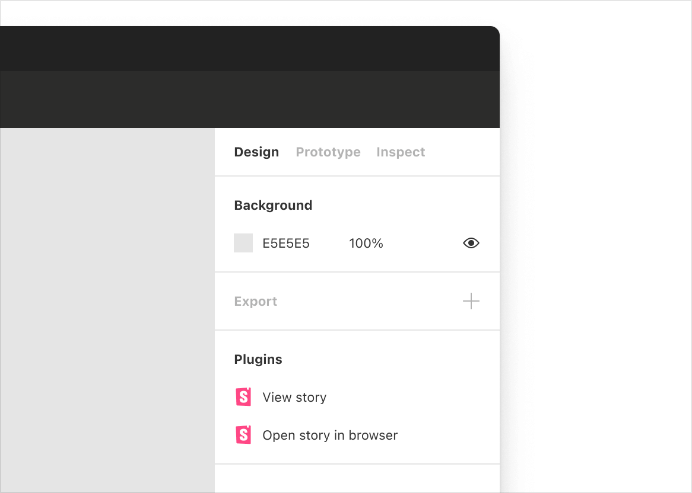
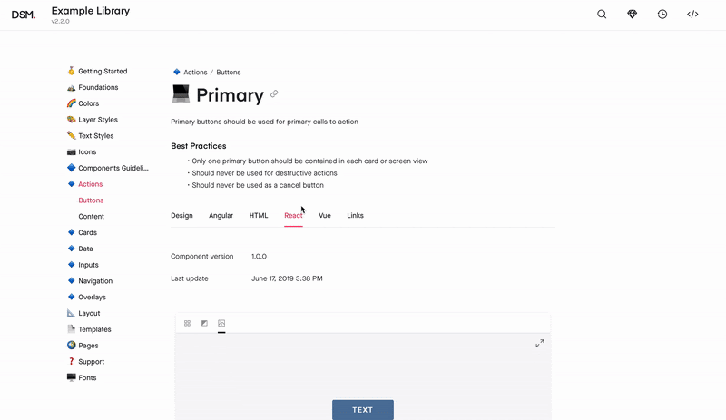

Storybook integrates with design tools to speed up your development workflow. That helps you debug inconsistencies earlier in the design process, discover existing components to reuse, and compare designs to stories.

## Figma

[Figma](https://www.figma.com/) is a collaborative UI design tool that allows multiple people to work on the same design simultaneously in the browser. There are two ways to integrate Storybook and Figma.

- [**Embed Storybook in Figma**](#embed-storybook-in-figma-with-the-plugin)
- [**Embed Figma in Storybook**](#embed-figma-in-storybook-with-the-addon)

### Embed Storybook in Figma with the plugin

[Storybook Connect](https://www.figma.com/community/plugin/1056265616080331589/Storybook-Connect) is a Figma plugin that allows you to embed component stories in Figma. It’s powered by [Storybook embeds](./embed.md) and [Chromatic](https://www.chromatic.com/?utm_source=storybook_website&utm_medium=link&utm_campaign=storybook), a publishing tool created by the Storybook team.

<video autoPlay muted playsInline loop>
  <source src="figma-plugin-open-story.mp4" type="video/mp4" />
</video>

#### Install plugin

Before we begin, you must have a Storybook [published to Chromatic](./publish-storybook.md#publish-storybook-with-chromatic). It provides the index, versions, and access control that back the plugin.

Go to [Storybook Connect](https://www.figma.com/community/plugin/1056265616080331589/Storybook-Connect) to install the plugin.

In Figma, open the command palette (in Mac OS, use `Command + /`, in Windows use `Control + /`) and type `Storybook Connect` to enable it.

Follow the instructions to connect and authenticate with Chromatic.

#### Link stories to Figma components

Link stories to Figma components, variants, and instances.

Go to a story in a Storybook published on Chromatic. Make sure it’s on the branch you want to link. Then copy the URL to the story.

In Figma, select the component, open the plugin, and paste the URL.

Chromatic will automatically update your linked stories to reflect the most recent Storybook published on the branch you linked. That means the link persists even as you push new code.

💡 The plugin does not support linking stories to Figma layers.

#### View stories in Figma

Once they're connected, you'll be able to view the story by clicking the link in the sidebar. Click "View story". Alternatively, open the plugin by using the command palette (in Mac OS, use `Command + /`, in Windows, use `Control + /`), then type `Storybook Connect`.

### Embed Figma in Storybook with the addon

[Design addon](https://storybook.js.org/addons/storybook-addon-designs) allows you to embed Figma files and prototypes in Storybook.

#### Install design addon

Run the following command to install the addon.

<!-- prettier-ignore-start -->

<CodeSnippets
  paths={[
    'common/storybook-figma-addon-install.yarn.js.mdx',
    'common/storybook-figma-addon-install.npm.js.mdx',
    'common/storybook-figma-addon-install.pnpm.js.mdx',
  ]}
/>

<!-- prettier-ignore-end -->

ℹ️ This addon is still being converted to fully support Storybook 7.0. If you're adding this addon to a Storybook 7.0 instance or migrating from a previous version, you must install the `beta` version.

Update your Storybook configuration (in `.storybook/main.js|ts`) to include the addon.

<!-- prettier-ignore-start -->

<CodeSnippets
  paths={[
    'common/storybook-main-figma-addon-register.js.mdx',
  ]}
/>

<!-- prettier-ignore-end -->

#### Link Figma components to stories

In Figma, open the file you want to embed in Storybook. You can embed files, prototypes, components, and frames.

- Embed a file or prototype, click the "Share" button to generate a unique URL for the file then click "Copy link".

- Embed a component or frame check "Link to selected frame" in the Share dialog. Or right click on the frame and go to "Copy/Paste as" » "Copy link".

In Storybook, add a new [parameter](../writing-stories/parameters.md) named `design` to your story and paste the Figma URL. For example:

<!-- prettier-ignore-start -->

<CodeSnippets
  paths={[
    'react/component-story-figma-integration.js.mdx',
    'react/component-story-figma-integration.ts.mdx',
    'vue/component-story-figma-integration.js.mdx',
    'vue/component-story-figma-integration.ts.mdx',
    'angular/component-story-figma-integration.ts.mdx',
    'svelte/component-story-figma-integration.js.mdx',
    'web-components/component-story-figma-integration.js.mdx',
    'web-components/component-story-figma-integration.ts.mdx',
    'solid/component-story-figma-integration.js.mdx',
    'solid/component-story-figma-integration.ts.mdx',
  ]}
  usesCsf3
  csf2Path="sharing/design-integrations#snippet-component-story-figma-integration"
/>

<!-- prettier-ignore-end -->

#### View designs in Storybook

Click the "Design" tab in the addon panel to view the embedded Figma design.

## Zeplin

[Zeplin](https://zeplin.io/) is a design tool that generates styleguides from [Sketch](https://www.sketch.com/), [Figma](https://www.figma.com/), and [Adobe XD](https://www.adobe.com/products/xd.html).

Use the [Zeplin addon](https://storybook.js.org/addons/storybook-zeplin) to connect Storybook. The addon displays designs from Zeplin alongside the currently selected story. It includes convenient tooling to overlay the design image atop the live component.

Zeplin's native app also supports [links to published Storybooks](https://support.zeplin.io/en/articles/5674596-connecting-your-storybook-instance-with-zeplin).

## Zeroheight

[Zeroheight](https://zeroheight.com/) is a collaborative styleguide generator for design systems. It showcases design, code, brand, and copywriting documentation in one place. Users can easily edit that documentation with a WYSIWYG editor.

Zeroheight integrates with [Storybook](https://zeroheight.com/3xlwst8/p/507ba7-storybook), enabling you to embed stories alongside your design specs.

## UXPin

[UXPin](https://www.uxpin.com/) is an interactive design tool that uses production code to generate prototypes.

UXPin allows you to [use interactive stories](https://www.uxpin.com/docs/merge/storybook-integration/) to design user flows.

<video autoPlay muted playsInline loop>
  <source
    src="storybook-uxpin.mp4"
    type="video/mp4"
  />
</video>

## InVision Design System Manager

[InVision DSM](https://www.invisionapp.com/design-system-manager) is a design system documentation tool. It helps design teams consolidate UX principles, user interface design, and design tokens in a shared workspace.

InVision allows you to embed [Storybook](https://support.invisionapp.com/hc/en-us/articles/360028388192-Publishing-Storybook-to-DSM) in your design system documentation.

## Adobe XD

[Adobe XD](https://www.adobe.com/products/xd.html) is a UI and UX design tool for creating wireframes, interactive designs, and prototypes.

Integrate Adobe XD with Storybook using the [design addon](https://storybook.js.org/addons/storybook-addon-designs/). You can [embed design specs](https://helpx.adobe.com/xd/help/publish-design-specs.html) alongside stories by following these [instructions](https://pocka.github.io/storybook-addon-designs/?path=/story/docs-iframe-readme--page).

## Build your own integration

Extend and customize Storybook by building an integration. Integrate with lower-level Storybook APIs or bootstrap an addon to customize Storybook's UI and behavior.

- [Addon documentation](../addons/introduction.md)
- [Create an addon tutorial](https://storybook.js.org/tutorials/create-an-addon/)
