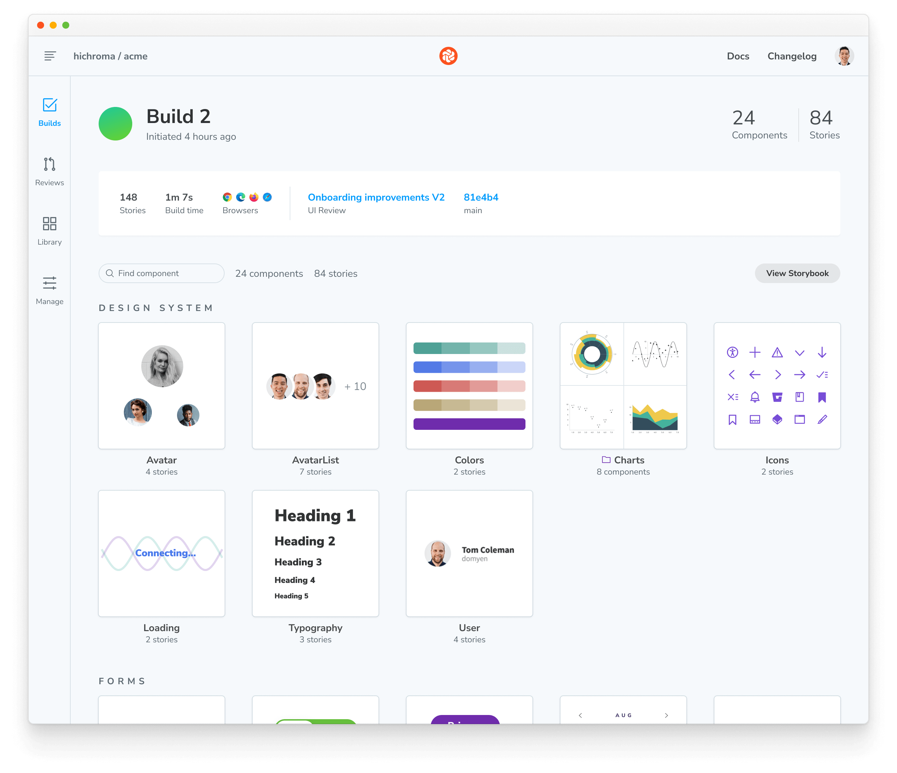

Teams publish Storybook online to review and collaborate on works in progress. That allows developers, designers, PMs, and other stakeholders to check if the UI looks right without touching code or requiring a local dev environment.

<video autoPlay muted playsInline loop>
  <source
    src="storybook-publish-review-optimized.mp4"
    type="video/mp4"
  />
</video>

## Build Storybook as a static web application

First, we'll need to build Storybook as a static web application. The functionality is already built-in and pre-configured for most supported frameworks. Others require a bit of customization (e.g., Angular). Run the following command inside your project's root directory:

<!-- prettier-ignore-start -->

<CodeSnippets
  paths={[
    'angular/custom-build-script-production.script-for-builder.js.mdx',
    'angular/build-storybook-production-mode.with-builder.js.mdx',
    'common/build-storybook-production-mode.yarn.js.mdx',
    'common/build-storybook-production-mode.npm.js.mdx',
  ]}
/>

<!-- prettier-ignore-end -->

<div class="aside">

💡 You can provide additional flags to customize the command. Read more about the flag options [here](../api/cli-options.md).

</div>

Storybook will create a static web application capable of being served by any web server. Preview it locally by running the following command:

```shell
npx http-server ./path/to/build
```

## Publish Storybook with Chromatic

Once you've built your Storybook as a static web app, you can publish it to your web host. We recommend [Chromatic](https://www.chromatic.com/), a free publishing service made for Storybook that documents, versions, and indexes your UI components securely in the cloud.


To get started, sign up with your GitHub, GitLab, Bitbucket, or email and generate a unique _project-token_ for your project.

Next, install the [Chromatic CLI](https://www.npmjs.com/package/chromatic) package from npm:

<!-- prettier-ignore-start -->

<CodeSnippets
  paths={[
    'common/chromatic-install.yarn.js.mdx',
    'common/chromatic-install.npm.js.mdx',
  ]}
/>

<!-- prettier-ignore-end -->

Run the following command after the package finishes installing. Make sure that you replace `your-project-token` with your own project token.

```shell
npx chromatic --project-token=<your-project-token>
```

When Chromatic finishes, you should have successfully deployed your Storybook. Preview it by clicking the link provided (i.e., https://random-uuid.chromatic.com).

```shell
Build 1 published.

View it online at https://www.chromatic.com/build?appId=...&number=1.
```



### Setup CI to publish automatically

Configure your CI environment to publish your Storybook and [run Chromatic](https://www.chromatic.com/docs/ci)) whenever you push code to a repository. Let's see how to set it up using GitHub Actions.

In your project's root directory, add a new file called `chromatic.yml` inside the `.github/workflows` directory:

<!-- prettier-ignore-start -->

<CodeSnippets
  paths={[
    'common/chromatic-github-action.js.mdx',
  ]}
/>

<!-- prettier-ignore-end -->

<div class="aside">

💡 Secrets are secure environment variables provided by GitHub so that you don't need to hard code your `project-token`. Read the [official documentation](https://docs.github.com/en/actions/security-guides/encrypted-secrets#creating-encrypted-secrets-for-a-repository) to learn how to configure them.

</div>

Commit and push the file. Congratulations, you've successfully automated publishing your Storybook. Now whenever you open a PR you’ll get a handy link to your published Storybook in your PR checks.


### Review with your team

Publishing Storybook as part of the development process makes it quick and easy to [gather team feedback](https://storybook.js.org/tutorials/design-systems-for-developers/react/en/review/).

A common method to ask for review is to paste a link to the published Storybook in a pull request or Slack.

If you publish your Storybook to Chromatic, you can use the [UI Review](https://www.chromatic.com/features/publish) feature to automatically scan your PRs for new and updated stories. That makes it easy to identify what changed and give feedback.


## Publish Storybook to other services

You can publish the static Storybook web app to many hosts. We maintain [`storybook-deployer`](https://github.com/storybookjs/storybook-deployer), a handy tool to help you publish to AWS or GitHub pages.

But features like [Composition](./storybook-composition.md), [embed](./embed.md), history, and versioning require tighter integration with Storybook APIs and secure authentication. Your hosting provider may not be capable of supporting these features. Learn about the Component Publishing Protocol (CPP) to see what.

<details>

<summary><h2>Component Publishing Protocol (CPP)</h2></summary>

Storybook can communicate with services that host built Storybooks online. This enables features such as [Composition](./storybook-composition.md). We categorize services via compliance with the "Component Publishing Protocol" (CPP) with various levels of support in Storybook.

### CPP level 1

This level of service serves published Storybooks and makes the following available:

- Versioned endpoints, URLs that resolve to different published Storybooks depending on a `version=x.y.z` query parameter (where `x.y.z` is the released version of the package).
- Support for `/stories.json`
- Support for `/metadata.json` and the `releases` field.

Example: [Chromatic](https://www.chromatic.com/)

### CPP level 0

This level of service can serve published Storybooks but has no further integration with Storybook’s APIs.

Examples: [Netlify](https://www.netlify.com/), [S3](https://aws.amazon.com/en/s3/)

</details>

## Search engine optimization (SEO)

If your Storybook is publically viewable, you may wish to configure how it is represented in search engine result pages.

### Title

Storybook will generate the document title (i.e. `<title>`) for you automatically, to include the currently-viewed component and story. By default, it looks something like "Components / Button - Primary ⋅ Storybook". You can modify the "Storybook" portion by adding the following to the `main.js` file in your config directory:

<!-- prettier-ignore-start -->

<CodeSnippets
  paths={[
    'common/seo-title.js.mdx',
  ]}
/>

<!-- prettier-ignore-end -->

### Description

You can provide a description for search engines to display in the results listing, by adding the following to the `manager-head.html` file in your config directory:

<!-- prettier-ignore-start -->

<CodeSnippets
  paths={[
    'common/seo-description.html.mdx',
  ]}
/>

<!-- prettier-ignore-end -->

### Preventing your Storybook from being crawled

You can prevent your published Storybook from appearing in search engine results by including a noindex meta tag, which you can do by adding the following to the `manager-head.html` file in your config directory:

<!-- prettier-ignore-start -->

<CodeSnippets
  paths={[
    'common/seo-noindex.html.mdx',
  ]}
/>

<!-- prettier-ignore-end -->
