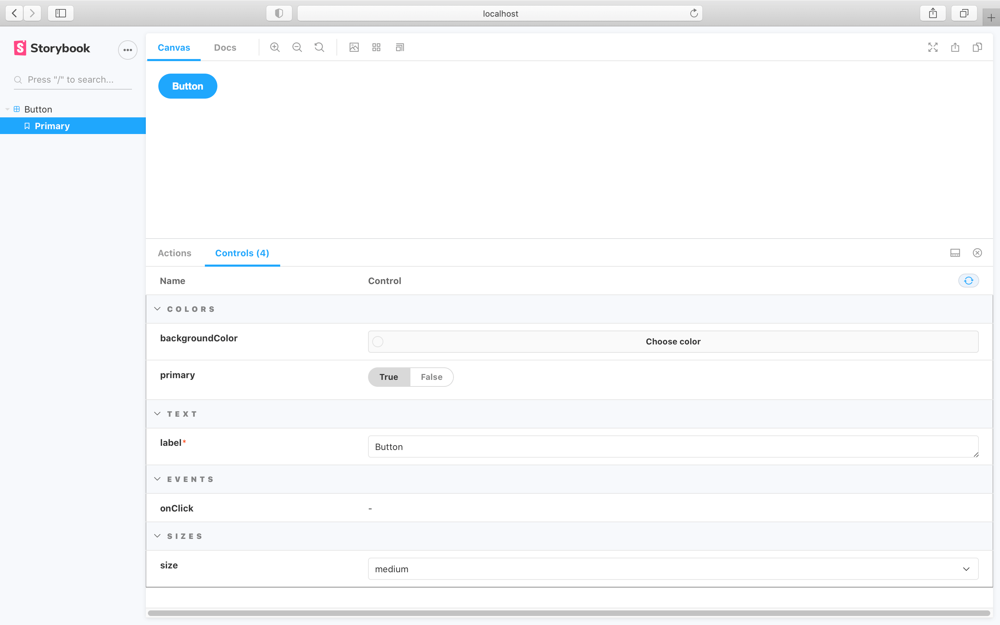
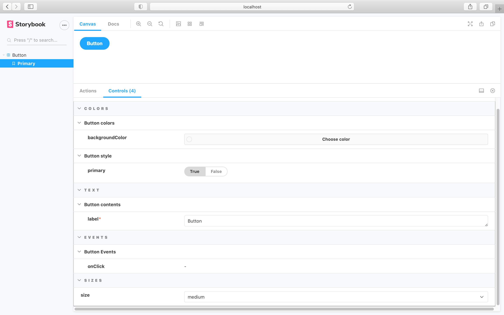

Storybook Docs automatically generates component args tables for components in supported frameworks. These tables list the arguments ([args for short](../writing-stories/args.md)) of the component, and even integrate with [controls](../essentials/controls.md) to allow you to change the args of the currently rendered story.

<video autoPlay muted playsInline loop>
  <source
    src="addon-controls-docs-optimized.mp4"
    type="video/mp4"
  />
</video>

This is extremely useful, but it can be further expanded. Additional information can be added to the component to better document it:

<!-- prettier-ignore-start -->

<CodeSnippets
  paths={[
    'react/button-component-with-proptypes.js.mdx',
    'react/button-component-with-proptypes.ts.mdx',
    'angular/button-component-with-proptypes.ts.mdx',
    'vue/button-component-with-proptypes.2.js.mdx',
    'vue/button-component-with-proptypes.ts-2.ts.mdx',
    'vue/button-component-with-proptypes.3.js.mdx',
    'vue/button-component-with-proptypes.ts-3.ts.mdx',
    'svelte/button-component-with-proptypes.js.mdx',
    'web-components/button-component-with-proptypes.js.mdx',
    'web-components/button-component-with-proptypes.ts.mdx',
  ]}
/>

<!-- prettier-ignore-end -->

The args tables will be updated accordingly by including the additional information (e.g., JSDocs comments), offering a richer experience for any stakeholders involved.

## Working with Automatic Docs

To use the `ArgsTable` Doc Block with Storybook's automatically generated documentation ([AutoDocs](./docs-page.md) for short), export a component property on your stories metadata:

<!-- prettier-ignore-start -->

<CodeSnippets
  paths={[
    'common/my-component-story.js.mdx',
  ]}
/>

<!-- prettier-ignore-end -->

### Working with MDX

If you need, you can also include the `ArgsTable` block in your MDX stories. Below is a condensed table of available options and examples:

| Option  | Description                                                                                         |
| ------- | --------------------------------------------------------------------------------------------------- |
| `of`    | Infers the args table from the component.   `<ArgsTable of={MyComponent} />`                    |
| `story` | Infers the args table based on a story.   `<ArgsTable story="example-mycomponent--my-story" />` |

<!-- prettier-ignore-start -->

<CodeSnippets
  paths={[
    'common/component-story-mdx-argstable-block-for-component.with-component.mdx.mdx',
    'common/component-story-mdx-argstable-block-for-story.with-story.mdx.mdx',
  ]}
/>

### Customizing

`ArgsTables` are generated based on an internal data structure called [ArgTypes](../api/argtypes.md). When you define the component's metadata element in your story, Storybook's Docs will automatically extract the ArgTypes based on available properties. 

If you need, you can customize what is displayed in the `ArgsTable` by extending the `ArgTypes` data, unless you're using the `ArgsTable of={component} />`. In this case, Storybook will infer the data automatically from the component.

Below is an abridged table and example featuring the available options.

| Field                          | Description                                                                                                                                                                                         |
|--------------------------------|-----------------------------------------------------------------------------------------------------------------------------------------------------------------------------------------------------|
| `name`                         | The name of the property.   `argTypes: { label: { name: 'Something' } }`                                                                                                                                           |
| `type.name`                    | Sets a type for the property.   `argTypes: { label: { type: { name: 'number' } } }`                                                                                                                       |
| `type.required`                | Sets the property as optional or required.   `argTypes: { label: { type: { required: true } }`                                                                                                  |
| `description`                  | Sets a Markdown description for the property.   `argTypes: { label: { description: 'Something' } }`                                                                                             |
| `table.type.summary`         | Provide a  short version of the type.   `argTypes: { label: { table: { type: { summary: 'a short summary' } }}}`                                                                                |
| `table.type.detail`          | Provides an extended version of the type.   `argTypes: { label: { table: { type: { detail: 'something' } }}}`                                                                                   |
| `table.defaultValue.summary` | Provide a short version of the default value.   `argTypes: { label: { table: { defaultValue: { summary: 'Hello World' } }}}`                                                                    |
| `table.defaultValue.detail`  | Provides a longer version of the default value.   `argTypes: { label: { table: { defaultValue: { detail: 'Something' } }}}`                                                                     |
| `control`                    | Associates a control for the property.   `argTypes: { label: { control: { type: 'text'} } }`  Read the  [Essentials documentation](../essentials/controls.md) to learn more about controls. |

<!-- prettier-ignore-start -->

<CodeSnippets
  paths={[
    'common/component-story-csf-argstable-customization.js.mdx',
    'common/component-story-mdx-argtypes.mdx.mdx',
  ]}
/>

<!-- prettier-ignore-end -->

💡 This API is experimental and may change outside the typical semver release cycle. Read the documentation to learn more about [ArgTypes](../api/argtypes.md).

This would render a row with a modified description, a type display with a dropdown that shows the detail, and no control.

#### Shorthands

To reduce the boilerplate code you have to write, Storybook provides some convenient shorthands to help you streamline your work. Below are some of the available shorthands.

| Type           | Shorthand                                                                                  |
| -------------- | ------------------------------------------------------------------------------------------ |
| `type.name`    | Assigns the type to a number property.   `argTypes: { label: { type: number }`         |
| `control.type` | Assigns a radio control for the property.   `argTypes: { size: { control: 'radio' } }` |

### Grouping

You can also extend the ArgsTable's customization by grouping related `argTypes` into categories or even subcategories. Based on the following component implementation:

<!-- prettier-ignore-start -->

<CodeSnippets
  paths={[
    'react/button-implementation.js.mdx',
    'react/button-implementation.ts.mdx',
    'angular/button-implementation.ts.mdx',
    'vue/button-implementation.2.js.mdx',
    'vue/button-implementation.ts-2.ts.mdx',
    'vue/button-implementation.3.js.mdx',
    'vue/button-implementation.ts-3.ts.mdx',
    'svelte/button-implementation.js.mdx',
    'web-components/button-implementation.js.mdx',
    'web-components/button-implementation.ts.mdx',
  ]}
/>

<!-- prettier-ignore-end -->

You could group similar properties for better organization and structure. Using the table below as a reference:

| Field               | Category |
| :------------------ | :------: |
| **backgroundColor** |  Colors  |
| **primary**         |  Colors  |
| **label**           |   Text   |
| **onClick**         |  Events  |
| **size**            |  Sizes   |

Results in the following change into your story and UI.

<!-- prettier-ignore-start -->

<CodeSnippets
  paths={[
    'common/button-story-argtypes-with-categories.js.mdx'
  ]}
/>

<!-- prettier-ignore-end -->

You can also extend the formula above and introduce subcategories, allowing better structuring and organization. Using the table below as a reference leads to the following change to your story and UI:

| Field               | Category |   Subcategory   |
| :------------------ | :------: | :-------------: |
| **backgroundColor** |  Colors  |  Button colors  |
| **primary**         |  Colors  |  Button style   |
| **label**           |   Text   | Button contents |
| **onClick**         |  Events  |  Button Events  |
| **size**            |  Sizes   |                 |

<!-- prettier-ignore-start -->

<CodeSnippets
  paths={[
    'common/button-story-argtypes-with-subcategories.js.mdx'
  ]}
/>

<!-- prettier-ignore-end -->

### Controls

The controls inside an `ArgsTable` are configured in exactly the same way as the [controls](../essentials/controls.md) addon pane. You’ll probably notice the table is very similar! It uses the same component and mechanism behind the scenes.
