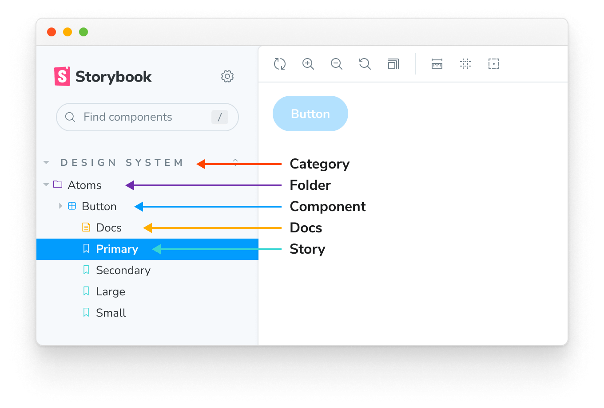

<YouTubeCallout id="VPfjrhDlkVc" title="How to Name Stories and Components" />

Storybook provides a powerful way to organize your stories, giving you the necessary tools to categorize, search, and filter your stories based on your organization's needs and preferences.

## Structure and hierarchy

When organizing your Storybook, there are two methods of structuring your stories: **implicit** and **explicit**. The [implicit method](../configure/sidebar-and-urls.md#csf-30-auto-titles) involves relying upon the physical location of your stories to position them in the sidebar, while the [explicit method](#naming-stories) involves utilizing the `title` parameter to place the story.

Based on how you structure your Storybook, you can see that the story hierarchy is made up of various parts:

- **Category**: The top-level grouping of stories and documentation pages generated by Storybook
- **Folder**: A mid-level organizational unit that groups components and stories in the sidebar, representing a feature or section of your application
- **Component**: A low-level organizational unit representing the component that the story is testing
- **Docs**: The automatically generated [documentation page](../writing-docs/autodocs.md) for the component
- **Story**: The individual story testing a specific component state

## Naming stories

When creating your stories, you can explicitly use the `title` parameter to define the story's position in the sidebar. It can also be used to [group](#grouping) related components together in an expandable interface to help with Storybook organization providing a more intuitive experience for your users. For example:

<!-- prettier-ignore-start -->

<CodeSnippets
  paths={[
    'angular/button-story-default-export.ts.mdx',
    'web-components/button-story-default-export.js.mdx',
    'web-components/button-story-default-export.ts.mdx',
    'common/button-story-default-export.js.mdx',
    'common/button-story-default-export.ts.mdx',
  ]}
  usesCsf3
  csf2Path="writing-stories/naming-components-and-hierarchy#snippet-button-story-default-export"
/>

<!-- prettier-ignore-end -->

Yields this:

## Grouping

It is also possible to group related components in an expandable interface to help with Storybook organization. To do so, use the `/` as a separator:

<!-- prettier-ignore-start -->

<CodeSnippets
  paths={[
    'angular/button-story-grouped.ts.mdx',
    'web-components/button-story-grouped.js.mdx',
    'web-components/button-story-grouped.ts.mdx',
    'common/button-story-grouped.js.mdx',
    'common/button-story-grouped.ts.mdx',
  ]}
  usesCsf3
  csf2Path="writing-stories/naming-components-and-hierarchy#snippet-button-story-grouped"
/>

<!-- prettier-ignore-end -->

<!-- prettier-ignore-start -->

<CodeSnippets
  paths={[
    'angular/checkbox-story-grouped.ts.mdx',
    'web-components/checkbox-story-grouped.js.mdx',
    'web-components/checkbox-story-grouped.ts.mdx',
    'common/checkbox-story-grouped.js.mdx',
    'common/checkbox-story-grouped.ts.mdx',
  ]}
  usesCsf3
  csf2Path="writing-stories/naming-components-and-hierarchy#snippet-checkbox-story-grouped"
/>

<!-- prettier-ignore-end -->

Yields this:

## Roots

By default, the top-level grouping will be displayed as “root” in the Storybook UI (i.e., the uppercased, non-expandable items). If you need, you can [configure Storybook](../configure/sidebar-and-urls.md#roots) and disable this behavior. Useful if you need to provide a streamlined experience for your users; nevertheless, if you have a large Storybook composed of multiple component stories, we recommend naming your components according to the file hierarchy.

## Single-story hoisting

Single-story components (i.e., component stories without **siblings**) whose **display name** exactly matches the component's name (last part of `title`) are automatically hoisted up to replace their parent component in the UI. For example:

<!-- prettier-ignore-start -->

<CodeSnippets
  paths={[
    'angular/button-story-hoisted.ts.mdx',
    'web-components/button-story-hoisted.js.mdx',
    'web-components/button-story-hoisted.ts.mdx',
    'common/button-story-hoisted.js.mdx',
    'common/button-story-hoisted.ts.mdx',
  ]}
  usesCsf3
  csf2Path="writing-stories/naming-components-and-hierarchy#snippet-button-story-hoisted"
/>

<!-- prettier-ignore-end -->

Because story exports are automatically "start cased" (`myStory` becomes `"My Story"`), your component name should match that. Alternatively, you can override the story name using `myStory.storyName = '...'` to match the component name.

## Sorting stories

Out of the box, Storybook sorts stories based on the order in which they are imported. However, you can customize this pattern to suit your needs and provide a more intuitive experience by adding `storySort` to the `options` parameter in your `preview.js` file.

<!-- prettier-ignore-start -->

<CodeSnippets
  paths={[
    'common/storybook-preview-sort-function.js.mdx',
    'common/storybook-preview-sort-function.ts.mdx',
  ]}
/>

<!-- prettier-ignore-end -->

<Callout variant="info">

Asides from the unique story identifier, you can also use the `title`, `name`, and import path to sort your stories using the `storySort` function.

</Callout>

The `storySort` can also accept a configuration object.

<!-- prettier-ignore-start -->

<CodeSnippets
  paths={[
    'common/storybook-preview-empty-sort-object.js.mdx',
    'common/storybook-preview-empty-sort-object.ts.mdx',
  ]}
/>

<!-- prettier-ignore-end -->

| Field            | Type    | Description                                              | Required | Default Value           | Example                   |
| ---------------- | ------- | -------------------------------------------------------- | -------- | ----------------------- | ------------------------- |
| **method**       | String  | Tells Storybook in which order the stories are displayed | No       | Storybook configuration | `'alphabetical'`          |
| **order**        | Array   | The stories to be shown, ordered by supplied name        | No       | Empty Array `[]`        | `['Intro', 'Components']` |
| **includeNames** | Boolean | Include story name in sort calculation                   | No       | `false`                 | `true`                    |
| **locales**      | String  | The locale required to be displayed                      | No       | System locale           | `en-US`                   |

To sort your stories alphabetically, set `method` to `'alphabetical'` and optionally set the `locales` string. To sort your stories using a custom list, use the `order` array; stories that don't match an item in the `order` list will appear after the items in the list.

The `order` array can accept a nested array to sort 2nd-level story kinds. For example:

<!-- prettier-ignore-start -->

<CodeSnippets
  paths={[
    'common/storybook-preview-with-ordered-pages.js.mdx',
    'common/storybook-preview-with-ordered-pages.ts.mdx',
  ]}
/>

<!-- prettier-ignore-end -->

Which would result in this story ordering:

1. `Intro` and then `Intro/*` stories
2. `Pages` story
3. `Pages/Home` and `Pages/Home/*` stories
4. `Pages/Login` and `Pages/Login/*` stories
5. `Pages/Admin` and `Pages/Admin/*` stories
6. `Pages/*` stories
7. `Components` and `Components/*` stories
8. All other stories

If you want specific categories to sort to the end of the list, you can insert a `*` into your `order` array to indicate where "all other stories" should go:

<!-- prettier-ignore-start -->

<CodeSnippets
  paths={[
    'common/storybook-preview-with-ordered-pages-and-wildcard.js.mdx',
    'common/storybook-preview-with-ordered-pages-and-wildcard.ts.mdx',
  ]}
/>

<!-- prettier-ignore-end -->

In this example, the `WIP` category would be displayed at the end of the list.

Note that the `order` option is independent of the `method` option; stories are sorted first by the `order` array and then by either the `method: 'alphabetical'` or the default `configure()` import order.
