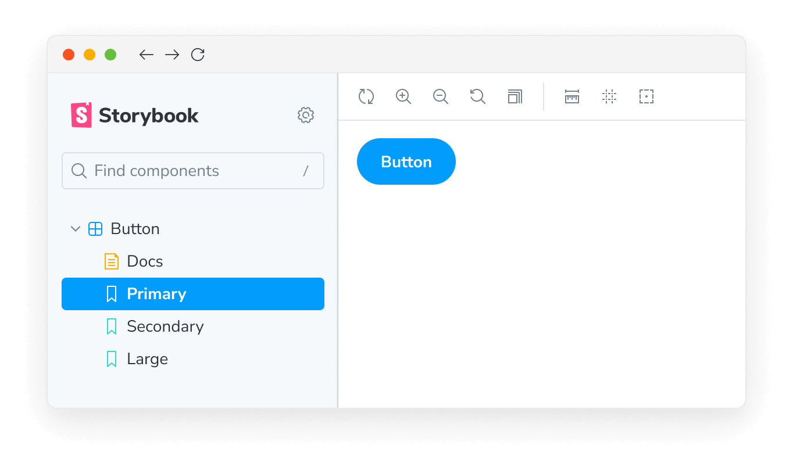
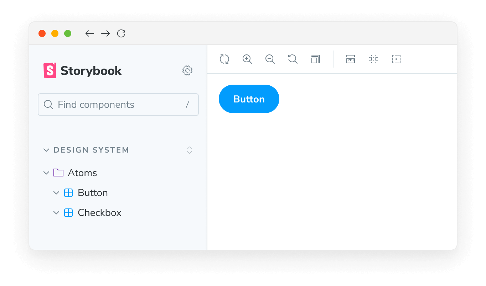

The title of the component you export in the `default` export controls the name shown in the sidebar.

<!-- prettier-ignore-start -->

<CodeSnippets
  paths={[
    'common/button-story-default-export.js.mdx',
  ]}
/>

<!-- prettier-ignore-end -->

Yields this:

## Grouping

It is also possible to group related components in an expandable interface in order to help with Storybook organization. To do so, use the `/` as a separator:

<!-- prettier-ignore-start -->

<CodeSnippets
  paths={[
    'common/button-story-grouped.js.mdx',
  ]}
/>

<!-- prettier-ignore-end -->

<!-- prettier-ignore-start -->

<CodeSnippets
  paths={[
    'common/checkbox-story-grouped.js.mdx',
  ]}
/>

<!-- prettier-ignore-end -->

Yields this:

## Roots

By default the top-level grouping will be displayed as a “root” in the UI (the all-caps, non expandable grouping in the screenshot above). If you prefer, you can [configure Storybook](../configure/sidebar-and-urls.md#roots) to not show roots.

We recommend naming components according to the file hierarchy.

## Single story hoisting

Stories which have **no siblings** (i.e. the component has only one story) and which **display name** exactly matches the component name (last part of `title`) will be hoisted up to replace their parent component in the sidebar. This means you can have stories files like this:

<!-- prettier-ignore-start -->

<CodeSnippets
  paths={[
    'common/button-story-hoisted.js.mdx',
  ]}
/>

<!-- prettier-ignore-end -->

This will then be visually presented in the sidebar like this:

Because story exports are automatically "start cased" (`myStory` becomes `"My Story"`), your component name should match that. Alternatively you can override the story name using `myStory.storyName = '...'` to match the component name.

## Sorting stories

By default, stories are sorted in the order in which they were imported. This can be overridden by adding `storySort` to the `options` parameters in your `preview.js` file.

The most powerful method of sorting is to provide a function to `storySort`. Any custom sorting can be achieved with this method.

<!-- prettier-ignore-start -->

<CodeSnippets
  paths={[
    'common/storybook-preview-sort-function.js.mdx',
  ]}
/>

<!-- prettier-ignore-end -->

The `storySort` can also accept a configuration object.

<!-- prettier-ignore-start -->

<CodeSnippets
  paths={[
    'common/storybook-preview-empty-sort-object.js.mdx',
  ]}
/>

<!-- prettier-ignore-end -->

| Field           |  Type   |                       Description                        | Required |      Default Value      |          Example          |
| --------------- | :-----: | :------------------------------------------------------: | :------: | :---------------------: | :-----------------------: |
| **method**      | String  | Tells Storybook in which order the stories are displayed |    No    | Storybook configuration |     `'alphabetical'`      |
| **order**       |  Array  |     The stories to be shown, ordered by supplied name     |    No    |    Empty Array `[]`     | `['Intro', 'Components']` |
| **includeName** | Boolean |          Include story name in sort calculation          |    No    |         `false`         |          `true`           |
| **locales**     | String  |           The locale required to be displayed            |    No    |      System locale      |          `en-US`          |

To sort your stories alphabetically, set `method` to `'alphabetical'` and optionally set the `locales` string. To sort your stories using a custom list, use the `order` array; stories that don't match an item in the `order` list will appear after the items in the list.

The `order` array can accept a nested array in order to sort 2nd-level story kinds. For example:

<!-- prettier-ignore-start -->

<CodeSnippets
  paths={[
    'common/storybook-preview-with-ordered-pages.js.mdx',
  ]}
/>

<!-- prettier-ignore-end -->

Which would result in this story ordering:

1. `Intro` and then `Intro/*` stories
2. `Pages` story
3. `Pages/Home` and `Pages/Home/*` stories
4. `Pages/Login` and `Pages/Login/*` stories
5. `Pages/Admin` and `Pages/Admin/*` stories
6. `Pages/*` stories
7. `Components` and `Components/*` stories
8. All other stories

If you want certain categories to sort to the end of the list, you can insert a `*` into your `order` array to indicate where "all other stories" should go:

<!-- prettier-ignore-start -->

<CodeSnippets
  paths={[
    'common/storybook-preview-with-ordered-pages-and-wildcard.js.mdx',
  ]}
/>

<!-- prettier-ignore-end -->

In this example, the `WIP` category would be displayed at the end of the list.

Note that the `order` option is independent of the `method` option; stories are sorted first by the `order` array and then by either the `method: 'alphabetical'` or the default `configure()` import order.
