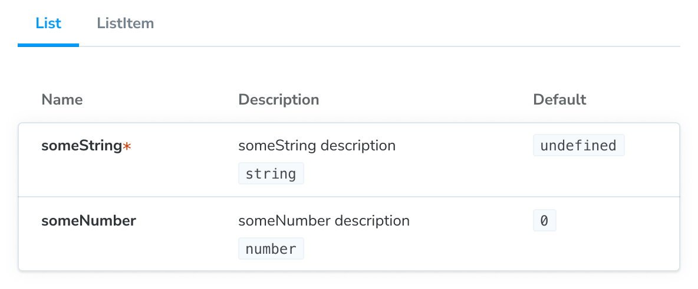

It's useful to write stories that [render two or more components](../writing-stories/index.md#stories-for-two-or-more-components) at once if those components are designed to work together. For example, `ButtonGroups`, `Lists`, and `Page` components. Here's an example with `List` and `ListItem` components:

<!-- prettier-ignore-start -->

<CodeSnippets
  paths={[
    'react/list-story-with-subcomponents.js.mdx',
    'react/list-story-with-subcomponents.ts.mdx',
    'angular/list-story-with-subcomponents.ts.mdx',
    'vue/list-story-with-sub-components.js.mdx',
    'vue/list-story-with-sub-components.ts.mdx',
    'web-components/list-story-with-subcomponents.js.mdx',
    'web-components/list-story-with-subcomponents.ts.mdx',
  ]}
  usesCsf3
  csf2Path="writing-stories/stories-for-multiple-components#snippet-list-story-with-subcomponents"
/>

<!-- prettier-ignore-end -->

Note that by adding a `subcomponents` property to the default export, we get an extra panel on the [ArgTypes](../writing-docs/doc-blocks.md#argtypes) and [Controls](../essentials/controls.md#) tables, listing the props of `ListItem`:

Subcomponents are only intended for documentation purposes and have some limitations:

1. The [argTypes](../api/arg-types.md) of subcomponents are [inferred (for the renderers that support that feature)](../api/arg-types.md#automatic-argtype-inference) and cannot be manually defined or overridden.
2. The table for each documented subcomponent does _not_ include [controls](../essentials/controls.md) to change the value of the props, because controls always apply to the main component's args.

Let's talk about some techniques you can use to mitigate the above, which are especially useful in more complicated situations.

## Reusing subcomponent stories

The simplest change we can make to the above is to reuse the stories of the `ListItem` in the `List`:

<!-- prettier-ignore-start -->

<CodeSnippets
  paths={[
    'react/list-story-unchecked.js.mdx',
    'react/list-story-unchecked.ts.mdx',
    'vue/list-story-unchecked.3.js.mdx',
    'vue/list-story-unchecked.3.ts.mdx',
    'angular/list-story-unchecked.ts.mdx',
    'web-components/list-story-unchecked.js.mdx',
    'web-components/list-story-unchecked.ts.mdx',
    'solid/list-story-unchecked.js.mdx',
    'solid/list-story-unchecked.ts.mdx',
  ]}
  usesCsf3
  csf2Path="writing-stories/stories-for-multiple-components#snippet-list-story-unchecked"
/>

<!-- prettier-ignore-end -->

By rendering the `Unchecked` story with its args, we are able to reuse the input data from the `ListItem` stories in the `List`.

However, we still aren’t using args to control the `ListItem` stories, which means we cannot change them with controls and we cannot reuse them in other, more complex component stories.

## Using children as an arg

One way we improve that situation is by pulling the rendered subcomponent out into a `children` arg:

<!-- prettier-ignore-start -->

<CodeSnippets
  paths={[
    'react/list-story-with-unchecked-children.js.mdx',
    'react/list-story-with-unchecked-children.ts.mdx',    
  ]}
  usesCsf3
  csf2Path="writing-stories/stories-for-multiple-components#snippet-list-story-with-unchecked-children"
/>

<!-- prettier-ignore-end -->

Now that `children` is an arg, we can potentially reuse it in another story.

However, there are some caveats when using this approach that you should be aware of.

The `children` `args` as any other arg needs to be JSON serializable. It means that you should:

- Avoid using empty values
- Use caution with components that include third party libraries

As they could lead into errors with your Storybook.

<Callout variant="info">

We're currently working on improving the overall experience for the children arg and allow you to edit children arg in a control and allow you to use other types of components in the near future. But for now you need to factor in this caveat when you're implementing your stories.

</Callout>

## Creating a Template Component

Another option that is more “data”-based is to create a special “story-generating” template component:

<!-- prettier-ignore-start -->

<CodeSnippets
  paths={[
    'react/list-story-template.js.mdx',
    'react/list-story-template.ts.mdx',
    'vue/list-story-template.3.js.mdx',
    'vue/list-story-template.3.ts.mdx',
    'angular/list-story-template.ts.mdx',
    'web-components/list-story-template.js.mdx',
    'web-components/list-story-template.ts.mdx',
    'solid/list-story-template.js.mdx',
    'solid/list-story-template.ts.mdx',
  ]}
  usesCsf3
  csf2Path="writing-stories/stories-for-multiple-components#snippet-list-story-template"
/>

<!-- prettier-ignore-end -->

This approach is a little more complex to setup, but it means you can more easily reuse the `args` to each story in a composite component. It also means that you can alter the args to the component with the Controls addon.
